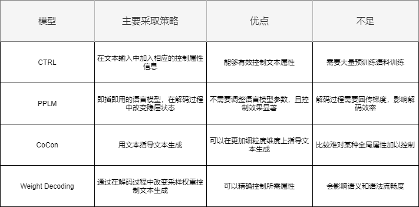

# 受控文本生成

## 受控文本生成介绍

### 受控文本生成在干啥
> 受控文本生成就是在基本不影响语义或者语法流畅度的情况下，对生成文本的属性比如主题、情感、风格、长度等作出控制。

### 为什么要做受控文本生成
>* 目前基于transformer结构的语言模型在文本生成工作上已经取得了令人十分深刻的印象，许多语言模型例如大家所熟知的GPT生成模型已经能够生成几乎以假乱真的语言。然而当前大多数语言模型有一个结果并不令人满意，那就是我们无法控制语言模型的输出内容。有时候生成的文本可能没有办法满足我们的需求。
>* 目前在工业界的很多应用场景中，文本生成（NLG）技术没有被大规模应用的原因之一就是生成文本不可控，得到的生成结果需要经过进一步筛选才能应用于业务场景中，增加了该项技术的使用成本。

## 受控文本生成技术对比

## 主要策略
* 模型输入加入额外控制信息作为特殊token
* 重新设计损失函数，兼顾语言模型的语法流畅度以及属性控制的精度

## 模型结构设计

